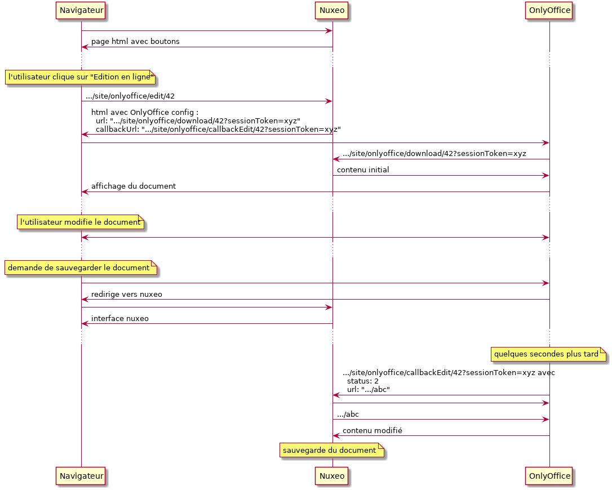

## Installation & configuration

### Génération des jar

```sh
mvn package -DskipTests
```

### Installation des jar

```sh
cp `find -name "*.jar"` /var/lib/nuxeo/server/nxserver/bundles/
cp `find ~/.m2 -name "java-jwt-3.2.0.jar"` /var/lib/nuxeo/server/nxserver/bundles/
```

### Configuration

Créez un fichier `/var/lib/nuxeo/server/nxserver/config/onlyoffice-config.xml` avec

```xml
<?xml version="1.0"?>
<component name="fr.edu.lyon.onlyoffice.ConfigService.contrib">
  <extension target="fr.edu.lyon.onlyoffice.ConfigService" point="config">
    <onlyoffice>
      <url>https://onlyoffice.univ.fr/</url>
      <algorithm>onlyoffice</algorithm>
      <prefix>onlyo</prefix>
    </onlyoffice>
  </extension>
</component>
```

Et un fichier `/var/lib/nuxeo/server/nxserver/config/onlyoffice-auth-config.xml` avec

```xml
<component name="onlyoffice.auth.config">
  <require>fr.esupportail.nuxeo.onlyoffice.jwt.auth</require>
  <extension target="org.nuxeo.ecm.platform.ui.web.auth.service.PluggableAuthenticationService"
      point="specificChains">
        <specificAuthenticationChain name="onlyoffice">
                <urlPatterns>
                        <url>(.*)/site/onlyoffice/(download|template|callback).*</url>
                </urlPatterns>
                <replacementChain>
                        <plugin>ONLYOFFICE_JWT_AUTH</plugin>
                </replacementChain>
        </specificAuthenticationChain>
  </extension>
</component>
```

L'algorithme et le préfixe sont utilisés pour générer le JWT (passé en paramètre `sessionToken`)

Créez un fichier `/var/lib/nuxeo/server/nxserver/config/onlyoffice-jwt-config.xml` avec

```xml
<?xml version="1.0"?>
<component name="fr.edu.lyon.jwt.service.PayloadPluginService.JwtSign">
  <extension target="fr.edu.lyon.jwt.service.PayloadPluginService" point="jwt-sign">
    <algorithm id="onlyoffice" name="HS256" key="secretkey" />
  </extension>
</component>
```

### Prise en compte

Vous devez ensuite redémarrer nuxeo

## Diagramme de séquence

Diagrammes générées avec : `plantuml diagrammes.puml`

### Edition d'un document existant dans Nuxeo



## Explications du code

### nuxeo-onlyoffice-core/src/main/resources/OSGI-INF/extensions/actions-contrib.xml
- ajout boutons "Edition en ligne", "Co-édition en ligne" (ie "autosave"), "Prévisualisation", "Créer"
- avec des `link` construits par

### nuxeo-onlyoffice-core/src/main/java/fr/edu/lyon/nuxeo/onlyoffice/view/OnlyOfficeActionsBean.java
- contenant .../site/onlyoffice/(edit|coedit|view|create)/&lt;docId&gt;
- cette url est gérée par

### nuxeo-onlyoffice-core/src/main/java/fr/edu/lyon/nuxeo/onlyoffice/webengine/OnlyOfficeWebservice.java
- les actions correspondant aux boutons créent une page javascript avec le template
#### nuxeo-onlyoffice-core/src/main/resources/skin/views/OnlyOffice/index.ftl
- avec comme `config`
  - `url` : .../site/onlyoffice/(download|template)/&lt;docId&gt;?sessionToken=&lt;sessionToken&gt;
  - `callbackUrl` : .../site/onlyoffice/(callbackCreate|callbackEdit|callbackCoEdit)/&lt;docId&gt;
  - généré par nuxeo-onlyoffice-core/src/main/java/fr/edu/lyon/nuxeo/onlyoffice/service/OnlyofficeConfig.java
